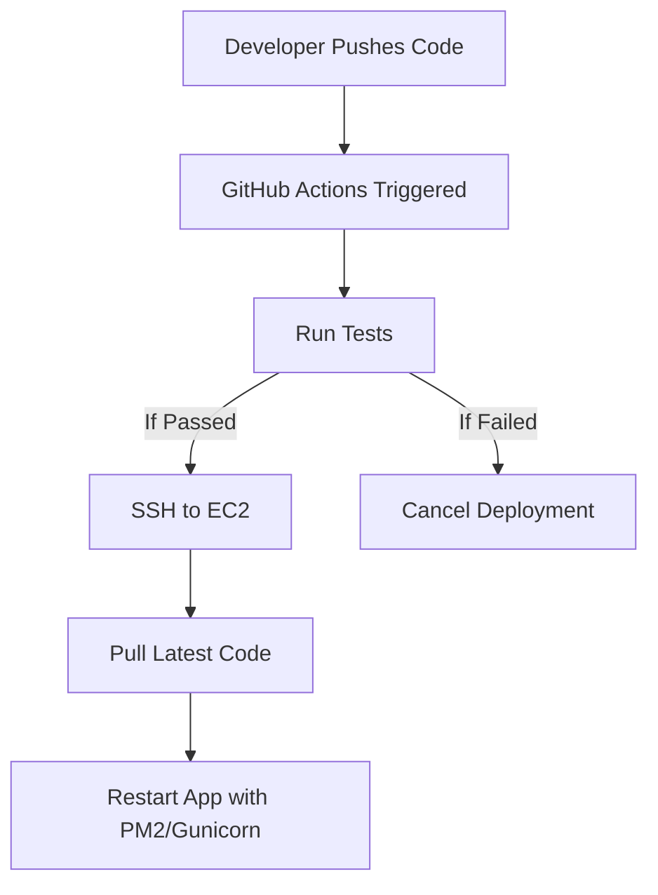

<h1 align="center">🚀 AutoForge</h1>

⚙️ Automate. Deploy. Deliver. — A blazing-fast CI/CD pipeline powered by GitHub Actions & AWS

  
  
  

---

## 🌩️ What is AutoForge?

> **AutoForge** is a real-world CI/CD solution that turns every code push into a fully automated deployment to the cloud. Built for developers and cloud engineers who want real control over their delivery pipeline — without the overhead.

---

## 🎯 Key Features

- 🔁 **Automated Deployment**  
  Push to `main` → AutoForge installs dependencies, pulls latest code to your AWS EC2 instance, and restarts the app — all hands-free!

- 🔐 **Secure Secrets Management**  
  AWS credentials, host info, and private keys are stored in GitHub Secrets for safe access.

- ✅ **Testing Before Deploying**  
  The pipeline includes a test phase. If tests fail, deployment stops. Quality-first!

- 🟢 **Deployment Status Badge**  
  Realtime CI badge in the README to show current build status (success/failure).

- 📈 **Modular & Extensible**  
  Easily extend to include Docker, ECS, CloudFront, etc. — DevOps made future-proof.

---

## 🧪 Tech Stack

| Layer           | Technology         |
|----------------|--------------------|
| 💻 Application  | Node.js / Python (modular) |
| ☁️ Cloud         | AWS EC2 (Ubuntu)   |
| 🔧 CI/CD         | GitHub Actions     |
| 🔐 Secrets Mgmt  | GitHub Secrets     |
| 📜 Deployment    | PM2 / Gunicorn     |

---

## 🛠️ How It Works

